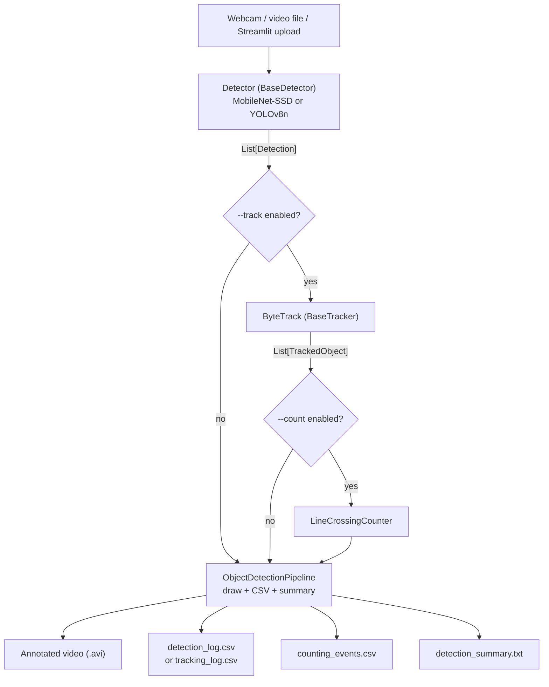

# Real-Time Object Detection, Tracking & Counting

A real-time object detection pipeline with a swappable detector backend
(**MobileNet-SSD** or **YOLOv8n**), optional **ByteTrack** multi-object
tracking for persistent identity, and optional **line-crossing IN/OUT
counting** on top of that. It runs from a CLI (`main.py`) or a **Streamlit**
web UI (`streamlit_app.py`), and includes separate scripts for accuracy
evaluation and speed benchmarking. Every stage is behind a small, testable
interface, so components can be swapped or extended without touching the
others.

## Real-world use case

Line-crossing counting on top of tracked detections is the core building
block behind a lot of real vision-based analytics: counting footfall through
a doorway, vehicles passing a point on a road, or people entering/leaving a
zone. This project implements exactly that pipeline end to end — detect,
track, count — on ordinary video, with two interchangeable detectors so the
speed/accuracy trade-off for a given deployment is a config choice, not a
rewrite.

## Architecture



Each arrow is a plain Python data type (`List[Detection]`,
`List[TrackedObject]`), not a shared class hierarchy — `src/detectors/*`
has no idea tracking or counting exist, and `src/tracking/*` has no idea
counting exists. `evaluate.py` and `benchmark.py` sit outside this diagram
entirely: they call `create_detector()` directly, over a fixed labeled
image set, and never touch the real-time capture loop.

## Features

- Two interchangeable detection backends behind a common interface:
  MobileNet-SSD (21 Pascal VOC classes) and YOLOv8n (80 COCO classes)
- Optional ByteTrack multi-object tracking on top of either detector's
  output, behind its own common tracker interface (`--track`)
- Optional line-crossing IN/OUT counting on top of tracking (`--count`)
- A Streamlit web UI as an alternative to the CLI (upload a video, configure
  everything in the sidebar, view/download results)
- Confidence-based filtering (configurable threshold)
- Bounding box annotations, per-class color coding, and an FPS/frame-count overlay
- Works on a live webcam **or** a video file
- Annotated output video (`.avi`)
- Per-frame CSV log (per-detection in detection-only mode, per-tracked-object
  with a `track_id` column when tracking is enabled), plus a separate
  per-crossing-event CSV when counting is enabled
- Text summary report (model used, tracking/counting on/off, frame count,
  elapsed time, average FPS, per-class totals, IN/OUT totals)
- Separate accuracy evaluation (`evaluate.py`) and speed benchmarking
  (`benchmark.py`) scripts, with a real (not fabricated) small labeled
  dataset and measured, honestly-caveated results (see below)
- Configurable via command-line flags — no hardcoded paths

## Project Structure

```
real-time-object-detection/
├── main.py                        # CLI entry point for the real-time pipeline
├── streamlit_app.py                 # Streamlit UI (thin -- calls src/app_core.py)
├── evaluate.py                      # accuracy evaluation CLI (precision/recall/F1/mAP@50/IoU)
├── benchmark.py                     # speed benchmark CLI (latency/FPS/detections/confidence dist.)
├── requirements.txt                  # core runtime dependencies (CLI pipeline only)
├── requirements-dev.txt              # + pytest, for running the test suite
├── requirements-app.txt              # + streamlit, imageio-ffmpeg, for the web UI
├── .streamlit/config.toml            # Streamlit's own settings (upload size, etc.)
├── models/                           # place model weights here (see below) -- gitignored
├── data/
│   └── eval/                         # small real, ground-truth-labeled evaluation image set (checked in)
│       ├── images/*.jpg
│       └── annotations.json
├── docs/images/                      # the two example screenshots used below (checked in)
├── src/
│   ├── config.py                     # CLI args + defaults (paths, model choice, thresholds, etc.)
│   ├── pipeline.py                   # ObjectDetectionPipeline: capture -> detect -> draw -> log (model-agnostic)
│   ├── app_core.py                   # Streamlit's orchestration logic (no UI code, no Streamlit import)
│   ├── csv_logger.py                 # per-frame detection CSV writer
│   ├── utils.py                      # pure helpers (box clamping, color mapping, FPS)
│   ├── detectors/
│   │   ├── base.py                   # Detection dataclass + BaseDetector interface
│   │   ├── mobilenet_ssd.py          # MobileNetSSDDetector (Caffe, via OpenCV DNN)
│   │   └── yolov8.py                 # YOLOv8Detector (Ultralytics)
│   ├── tracking/
│   │   ├── base.py                   # TrackedObject dataclass + BaseTracker interface
│   │   ├── bytetrack_tracker.py      # ByteTrackTracker (wraps ultralytics' BYTETracker)
│   │   └── csv_logger.py             # per-frame tracking CSV writer (separate schema/file)
│   ├── counting/
│   │   ├── line.py                   # CountingLine (orientation, position, IN direction)
│   │   ├── counter.py                # LineCrossingCounter: crossing detection + duplicate-prevention
│   │   └── csv_logger.py             # per-crossing-event CSV writer
│   └── evaluation/
│       ├── metrics.py                # IoU, GT matching, precision/recall/F1, mAP@50 (pure functions)
│       ├── dataset.py                # loads data/eval/
│       ├── class_names.py            # VOC <-> COCO class-name normalization
│       └── prepare_dataset.py        # documents/reproduces how data/eval/ was derived from COCO128
├── tests/                            # unit + smoke tests (see Testing below)
└── detection_results/                 # created at runtime: video, CSV, summary -- gitignored
```

## Installation

```bash
python -m venv venv
# Windows:
venv\Scripts\activate
# macOS/Linux:
source venv/bin/activate

pip install -r requirements.txt              # CLI pipeline only
pip install -r requirements-app.txt          # + the Streamlit UI
pip install -r requirements-dev.txt          # + pytest, to run the test suite
```

`requirements-app.txt` and `requirements-dev.txt` both pull in
`requirements.txt` already, so you only need one of them plus, optionally,
the other.

### Model weights

- **MobileNet-SSD**: place `deploy.prototxt.txt` and
  `mobilenet_iter_73000.caffemodel` in `models/` (available from the
  [MobileNet-SSD Caffe Model Zoo](https://github.com/chuanqi305/MobileNet-SSD)).
  Not committed to this repo — see Repository hygiene below.
- **YOLOv8n**: no manual step needed. Ultralytics downloads the official
  pretrained weights to `models/yolov8n.pt` automatically on first use.

> **Note:** `opencv-python` 5.x removed the Caffe importer
> (`cv2.dnn.readNetFromCaffe` no longer exists) -- `requirements.txt` pins
> `opencv-python<5` for this reason. This doesn't affect YOLOv8, which
> doesn't go through `cv2.dnn`.

## CLI usage

```bash
# MobileNet-SSD (default), webcam, with live preview window
python main.py

# YOLOv8n instead
python main.py --model yolov8

# Run on a video file instead of a webcam
python main.py --source path/to/video.mp4

# Headless (no preview window), video/CSV output only
python main.py --no-display

# YOLOv8n + ByteTrack (persistent IDs)
python main.py --model yolov8 --track

# YOLOv8n + ByteTrack + line-crossing counting
python main.py --model yolov8 --count --line-orientation vertical --count-classes person car
```

Run `python main.py --help` for the full flag list. Select which detector
runs with `--model {mobilenet,yolov8}` (default: `mobilenet`); tune YOLOv8
device placement with `--device` (CPU by default; pass a CUDA device id if
one is available -- MobileNet-SSD always runs on OpenCV DNN's default CPU
backend, see Benchmarking below).

### Tracking (`--track`)

Inserts ByteTrack between the detector and the drawing/logging step:
`src/detectors/*` are completely unaware tracking exists, and
`src/tracking/bytetrack_tracker.py` converts the detector's `Detection`
objects into ByteTrack's expected input, then converts ByteTrack's output
back into `TrackedObject` (`track_id`, `class_id`, `class_name`,
`confidence`, `x1, y1, x2, y2`). Built on
`ultralytics.trackers.byte_tracker.BYTETracker` (already inside the
`ultralytics` dependency, so no separate, harder-to-build tracking package
is needed) plus `lap` (linear assignment solver).

| Flag | Meaning | Default |
|---|---|---|
| `--track-buffer` | Frames to keep a lost track alive before dropping it | 30 |
| `--track-high-thresh` | Confidence for first-stage track association | 0.25 |
| `--match-thresh` | IoU/cost threshold for track association | 0.8 |

Tracking has been built and tested with **YOLOv8n as the primary detector**;
because it consumes the common `Detection` interface it's technically
detector-agnostic (it would also accept MobileNet-SSD's output), but that
combination is untested and unclaimed here.

**A new object's ID does not appear on its very first detected frame** --
ByteTrack requires two consecutive matched detections before a track is
"activated." Confirmed directly during testing: a second object introduced
into a scene got its own persistent ID starting from its *second*
consecutive appearance. This is standard ByteTrack behavior, not a bug.

**Not claimed:** a tracking-accuracy metric (MOTA/IDF1 needs frame-by-frame
tracking ground truth, which doesn't exist for this project -- "IDs persist
correctly" here is observed and demonstrated, not benchmarked), or that
tracking improves detection accuracy (it only assigns identity to detections
already made; a missed detection is still missed with tracking on).

### Counting (`--count`)

`--count` implies `--track` (counting needs persistent IDs) and adds a
`LineCrossingCounter` that consumes the `TrackedObject` list — it has no
knowledge of detectors or ByteTrack internals, and lives entirely in its own
`src/counting/` module.

**How a crossing is detected.** Each tracked object contributes one
coordinate per frame — its box-centroid y (horizontal line) or x (vertical
line). The counter caches each track's previous-frame coordinate; if the
current and previous coordinates fall on opposite sides of the line, that
track crossed it this frame, and the direction (increasing vs decreasing
coordinate) is compared against `--in-direction` to call it IN or OUT. This
is a discrete per-frame check on box centroids, not sub-pixel motion
interpolation.

**Duplicate prevention.** Each track contributes at most one IN event and
at most one OUT event, ever — an oscillating track doesn't inflate the
count. Tracks that never reach the line, or disappear before crossing,
simply never get an entry.

```bash
# Count objects crossing the horizontal middle of the frame (default)
python main.py --model yolov8 --count

# A vertical line at 30% of frame width, only counting "person" and "car"
python main.py --model yolov8 --count --line-orientation vertical --line-position 0.3 --count-classes person car

# Explicit IN direction (down/up for horizontal, left/right for vertical)
python main.py --model yolov8 --count --line-orientation vertical --in-direction left
```

| Flag | Meaning | Default |
|---|---|---|
| `--count` | Enable counting (implies `--track`) | off |
| `--line-orientation` | `horizontal` or `vertical` | `horizontal` |
| `--line-position` | Fraction (0-1) of frame height/width | `0.5` |
| `--in-direction` | `down`/`up` (horizontal) or `left`/`right` (vertical) | `down` / `right` |
| `--count-classes` | Only count these class names (space-separated) | all classes |

**Not claimed:** counting accuracy against ground truth (no labeled "true
crossing count" exists for any test video here — correctness was verified
by construction with synthetic trajectories, and by one manually-verified
real case: a real object's tracked centroid was traced frame-by-frame
independently of the counter, confirmed to cross the line at a specific
frame, and the counter reported exactly that frame/direction/position — see
Testing), or that every real-world object is counted correctly (a missed
detection, ID switch, or track lost right at the line will under- or
mis-count).

## Streamlit usage

A web UI over the same pipeline, for demoing without a terminal.

```bash
pip install -r requirements-app.txt
streamlit run streamlit_app.py
```

It lets you: upload a video; choose MobileNet-SSD or YOLOv8n; enable/disable
tracking; enable/disable counting (auto-enables tracking, same as the CLI);
configure the counting line (orientation, position, IN direction) and an
optional class filter (populated from the correct 21- or 80-class vocabulary
for whichever detector is selected); run the pipeline; view the annotated
result and the summary; and download the CSV(s) and video.

**Design note:** `streamlit_app.py` contains only widgets and display code.
Every actual decision — building the `Config`, constructing the
detector/tracker/counter, running `ObjectDetectionPipeline` — happens in
`src/app_core.run_pipeline()`, which has no Streamlit import and is exactly
what `tests/test_app_core.py`'s smoke tests call directly. The UI is a thin
wrapper around the same code path the CLI uses, not a second implementation.

**Video preview caveat:** the pipeline writes `.avi` (XVID), which most
browsers won't play in an HTML5 `<video>` element. The app makes a
best-effort separate H.264/mp4 copy for in-browser preview (via the portable
ffmpeg binary bundled by `imageio-ffmpeg` — no system ffmpeg install
needed), confirmed working in this environment. If that conversion isn't
available, the app falls back to offering the original file for download,
which plays fine in a local media player (e.g. VLC) regardless of browser
codec support.

**Validation and error messages.** The UI (via `app_core.run_pipeline`,
`AppConfigError`) gives a clear message instead of a crash/traceback for:
missing MobileNet-SSD weight files, a video file that won't open (corrupt or
unsupported format), an invalid counting-line configuration (e.g. a
direction that doesn't match the chosen orientation), and an unsupported
model string. Counting-without-tracking isn't an error state at all — like
the CLI, the UI silently enables tracking when counting is turned on.

## Example outputs

**Tracking** (`--model yolov8 --track`) — each box gets a persistent
`ID <n>`, not just a class label:


**Counting** (`--model yolov8 --count --line-orientation vertical`) — the
counting line (cyan) plus a live `IN`/`OUT` tally; this frame is right after
the bus crossed the line, so `OUT: 1`:


Both are real frames from real pipeline runs during development (not mockups).

## Output files

Each run writes to `detection_results/` (configurable via `--output-dir`):

- `detection_<timestamp>.avi` — annotated video (unless `--no-video`); shows
  `ID <track_id> <class>: <confidence>%` per box when tracking is enabled
  (`<class>: <confidence>%` in detection-only mode), plus the counting line
  and an `IN: n  OUT: n` overlay when counting is enabled
- **Detection-only mode:** `detection_log.csv` — one row per detected object,
  columns `frame, timestamp, label, confidence, x1, y1, x2, y2` (unless `--no-csv`)
- **Tracking mode (`--track`):** `tracking_log.csv` instead — one row per
  tracked object, columns
  `frame, timestamp, track_id, class_id, class_name, confidence, x1, y1, x2, y2`
- **Counting mode (`--count`):** additionally, `counting_events.csv` — one
  row *per crossing event* (not per frame), columns
  `frame, timestamp, track_id, class_name, direction, crossing_position`
- `detection_summary.txt` — model used, whether tracking/counting are
  enabled, total frames, processing time, average FPS, per-class detection
  totals, and (when counting is enabled) total IN, total OUT, counts by
  class, unique tracks observed, and number of crossing events

A run log is also written to `object_detection.log` (configurable via
`--log-file`) and streamed to the console.

## Testing

```bash
pip install -r requirements-dev.txt
pytest
```

The suite is almost entirely offline/fast unit tests on synthetic data:
`config`, `csv_logger`, `utils`, the model-selection/tracker-selection
factory dispatch (fake backends, no real weights or inference), the
evaluation metrics (IoU, GT matching, precision/recall/F1, mAP@50 --
including empty-predictions and empty-ground-truth edge cases), ByteTrack
wrapping (input/output conversion, plus using the real lightweight
`BYTETracker` to confirm ID persistence and distinct IDs for simultaneous
objects), counting (left/right and toward/away crossings, never-crosses,
disappears-before-crossing, duplicate-crossing prevention, class filtering,
empty input, multiple simultaneous objects), and the
`ObjectDetectionPipeline` guard that rejects a counter passed without a
tracker.

`tests/test_app_core.py` is the exception: it's a genuine end-to-end smoke
test of `src/app_core.run_pipeline()` — the same function the Streamlit UI
calls — using MobileNet-SSD (its weights don't require a network download
at test time, unlike YOLOv8n's) against a short real video built from a
checked-in eval image. It exercises detection+tracking+counting together,
detection-only mode, the counting-without-tracking auto-enable, an invalid
counting-line rejection, an unsupported-model rejection, and both
missing/corrupt video file rejections. These tests **skip** (not fail) if
MobileNet-SSD's weight files aren't present locally, since those aren't
committed to the repo (see Repository hygiene).

**What was manually verified beyond automated tests** (all with real
weights, real video, no mocking): CLI detection-only, tracking, and counting
modes all run cleanly and produce the documented output files; a real
object's tracked centroid was traced independently frame-by-frame and
matched the counter's reported crossing frame/direction/position exactly;
the Streamlit app starts cleanly, serves HTTP 200, and passes its own health
check with no exceptions logged (full interactive browser testing — actual
file upload through a browser — wasn't performed, since no browser is
available in this development environment; the UI's actual processing logic
is what the automated smoke tests exercise).

## Evaluation methodology (accuracy)

**Available data, and why a custom dataset was needed.** The original repo
contained no ground-truth-labeled data at all — only one already-annotated,
re-encoded output video and a text summary. That video is unsuitable as an
accuracy benchmark: no ground truth to compare against, and
re-encoding/pre-existing overlays would bias any comparison. So a small
labeled dataset was required from scratch.

**Where the eval data came from.** Rather than hand-drawing boxes (which
would be subjective, imprecise pixel-estimates with no external check),
`data/eval/` was derived from **COCO128** (Ultralytics' fixed, small,
official subset of real COCO train2017 images with professionally
human-annotated ground truth). `src/evaluation/prepare_dataset.py` documents
and reproduces exactly how: it keeps only the images whose ground truth is
**entirely within the 20 Pascal VOC classes** MobileNet-SSD can predict
(COCO's other 60 classes, e.g. "laptop", are outside its vocabulary --
including them would make it fail by construction, not by being worse), and
converts YOLO-normalized labels to absolute-pixel boxes with COCO class
names. This yielded **20 real, unmodified JPEGs with 83 ground-truth boxes
across 14 shared classes**. `src/evaluation/class_names.py` maps
MobileNet-SSD's VOC names to their COCO equivalents (e.g. `aeroplane`→
`airplane`) so both models' predictions compare against the same labels.

**Metrics** (`src/evaluation/metrics.py`, pure functions, unit-tested): IoU;
per-image/per-class greedy highest-confidence-first matching at IoU≥0.5;
precision/recall/F1 aggregated at IoU@0.5; mAP@50 (per-class average
precision, all-point interpolation, averaged over classes with ground truth
present); mean IoU of matched true positives only.

Run it with `python evaluate.py` (both models) or `python evaluate.py --models yolov8`.

## Benchmarking methodology (speed)

`benchmark.py` measures **speed only** — it does not touch accuracy. For
each model: a configurable number of warm-up frames are run and discarded
first (excluding one-time model/JIT overhead from the timing), then
`detector.detect(frame)` is timed individually per frame, over the **same
fixed set of frames, at the same resolution, and the same confidence
threshold** for every model in the run — by default, the same 20 images
used for evaluation, so speed and accuracy results are directly comparable.
Reports mean/median/p95 latency, FPS, detection counts, confidence
distribution, device used, and input resolution. Run it with
`python benchmark.py`.

MobileNet-SSD always runs on OpenCV DNN's default CPU backend (no CUDA
backend was wired up), so its reported device is always `cpu` regardless of
`--device`; only YOLOv8 respects `--device`.

## Measured results

Measured on this development machine (CPU only), single run, 20 images from
`data/eval/`, confidence threshold 0.5, IoU@0.5. **These are small-sample,
single-run numbers — informative, not a statistically rigorous benchmark.**

**Accuracy** (`python evaluate.py`):

| Model | Precision | Recall | F1 | mAP@50 | Mean IoU | TP / FP / FN |
|---|---|---|---|---|---|---|
| MobileNet-SSD | 1.000 | 0.193 | 0.323 | 0.396 | 0.843 | 16 / 0 / 67 |
| YOLOv8n | 1.000 | 0.398 | 0.569 | 0.548 | 0.844 | 33 / 0 / 50 |

**Speed** (`python benchmark.py`, same 20 images, 5 warm-up frames excluded):

| Model | Device | Resolution | Mean latency | FPS | Total detections |
|---|---|---|---|---|---|
| MobileNet-SSD | cpu | varies (native per image) | 36.0 ms | 27.8 | 16 |
| YOLOv8n | cpu | varies (native per image) | 89.2 ms | 11.2 | 33 |

**Speed and accuracy are reported separately on purpose, and neither implies
the other.** MobileNet-SSD is faster per frame on this CPU but detects
roughly half as much of what's actually there (recall 0.19 vs 0.40);
YOLOv8n is slower per frame here but finds substantially more of the labeled
objects. Neither number alone says "better" — a real deployment decision
depends on which matters more for the use case. Both models had zero false
positives on this specific set, meaning whatever each model *did* detect was
correct — the gap between them here is almost entirely about how much each
one misses, not about wrong detections.

No deployment-specific performance (e.g. Streamlit request latency, upload
handling time under load) is claimed anywhere in this README, since none of
that was measured — only the CLI-level detection/tracking speed above was.

## Repository hygiene

- **No model weights committed** — `models/*` is gitignored except
  `.gitkeep`; MobileNet-SSD weights must be placed there manually, YOLOv8n's
  download automatically at runtime.
- **No generated videos/logs committed** — `detection_results/`, `*.log`,
  and stray `.avi`/`.mp4` files at the repo root (from ad-hoc local testing)
  are all gitignored.
- **No absolute or machine-specific paths** anywhere in the source (checked
  by grepping for `C:\Users`, `/home/`, `/Users/` across all `.py` files --
  none found; every path is relative to `PROJECT_ROOT`, computed from the
  source file's own location).
- **`data/eval/` is intentionally committed** (small, real, ~1MB) since it's
  a fixture the evaluation/tests need, not a generated artifact.
- **`docs/images/*.jpg`** (the two screenshots above, ~155KB combined) are
  likewise intentionally committed, genuinely-used documentation assets, not
  generated build output.
- **Dependencies are split by what actually needs them**: `requirements.txt`
  (CLI pipeline only), `requirements-dev.txt` (+ pytest),
  `requirements-app.txt` (+ streamlit, imageio-ffmpeg) — so a CLI-only user
  never needs to install Streamlit or a bundled ffmpeg binary.

## Limitations

- **Sample size.** 20 images / 83 boxes / 14 classes is enough to demonstrate
  a real, reproducible evaluation pipeline, not to draw statistically
  confident conclusions about either model's true accuracy. Per-class AP is
  based on very few instances per class (some classes have just 1–2 boxes).
- **Shared-vocabulary restriction.** The eval dataset only includes the 20
  classes MobileNet-SSD can predict; YOLOv8n's accuracy on its other 60 COCO
  classes is not evaluated here.
- **Confidence threshold is fixed at 0.5 for both models in the reported
  numbers**, and only mAP@50 is computed (no mAP@50:95, no full PR-curve
  sweep across thresholds).
- **Latency numbers are single-run, CPU-only**, on this development machine
  — no repeated trials/variance reporting, no GPU comparison measured.
- **Tracking and counting have no ground-truth-based accuracy metric**
  (no MOTA/IDF1, no labeled "true crossing count" exists for any test video
  here) — both were verified by construction (unit tests with known
  synthetic cases) and by manually-verified real cases, not benchmarked
  against ground truth. See the Tracking/Counting sections above for exactly
  what was and wasn't verified.
- Tracking/counting were built and tested with YOLOv8n; using them with
  MobileNet-SSD is possible through the same interfaces but untested.
- ByteTrack's 2-frame track-confirmation delay means a newly appeared
  object's ID is not reported on its very first detected frame.
- The overlay text is plain white with no outline (a pre-existing style,
  unchanged since Phase 1) — against a bright/white background it can be
  hard to read; this is a rendering/contrast characteristic, not incorrect
  underlying data.
- The pipeline's native video output (`.avi`/XVID) isn't browser-playable;
  the Streamlit app's H.264 preview conversion is best-effort and depends on
  `imageio-ffmpeg`'s bundled binary being available.
- No object re-identification across camera views, no multi-line/zone
  counting, no threaded capture (capture and inference share the main loop,
  capping achievable FPS versus a producer/consumer pipeline), no
  containerized/cloud deployment.

## Future improvements

- A larger, more balanced evaluation set (more images per class) for
  statistically meaningful accuracy comparisons, plus mAP@50:95 and a
  PR-curve sweep across confidence thresholds.
- GPU-vs-CPU benchmarking now that `--device` exists for YOLOv8, with
  repeated trials and variance reporting rather than single runs.
- A tracking/counting accuracy evaluation against real labeled ground truth
  (frame-by-frame track annotations and a true crossing count for at least
  one test video), enabling genuine MOTA/IDF1 and counting-accuracy numbers.
- Multi-line or zone-based counting, and unique-object counting beyond
  simple IN/OUT totals.
- A threaded or async capture/inference pipeline to decouple camera read
  rate from model inference time.
- Containerized deployment (Dockerfile) and/or hosting the Streamlit app
  (e.g. Streamlit Community Cloud, a small cloud VM) for a live public demo.
- A proper H.264 encode path in the core pipeline itself (not just a
  Streamlit-side preview copy), once a reliable cross-platform encoder is
  confirmed available.

## Author

Twinkle Gupta
